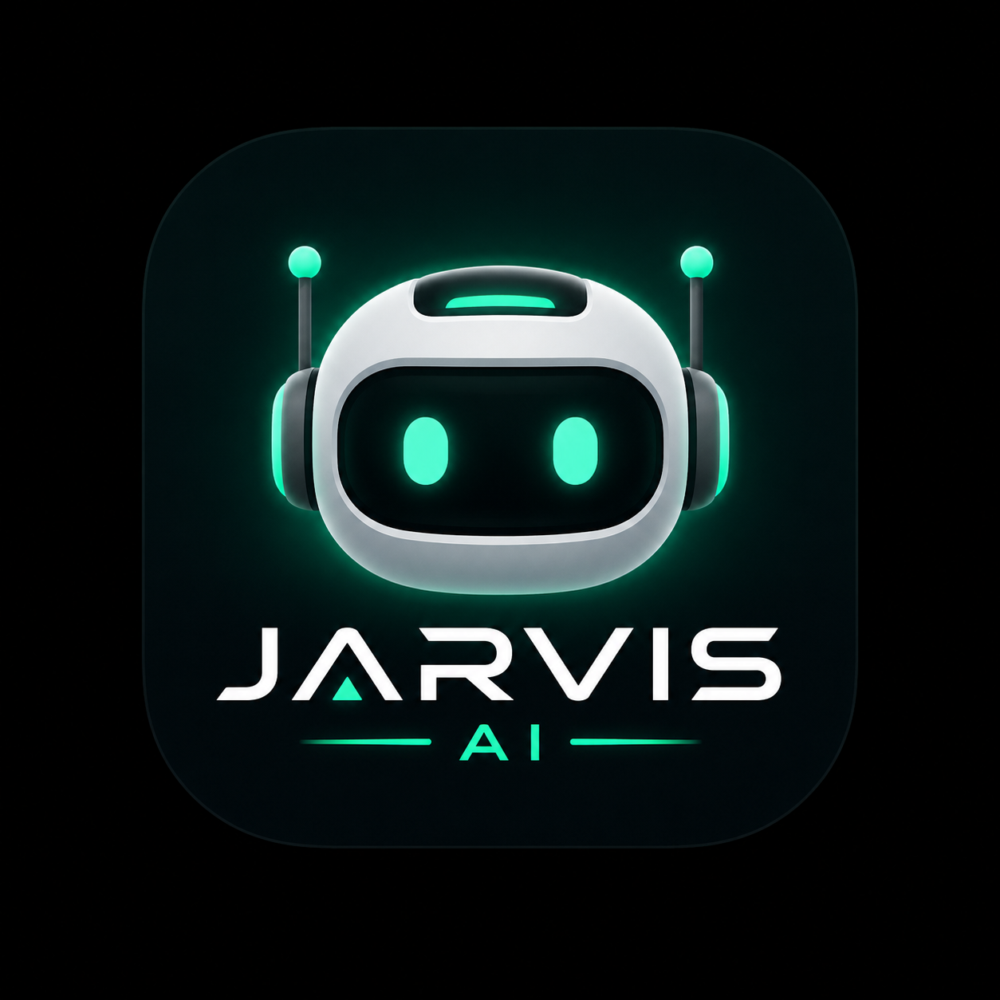

# 🤖 JARVIS AI

<p align="center">
  
</p>

<p align="center">
  <b>A Full-Stack Multi-Model AI Assistant built with React, Node.js, Express, MongoDB, Ollama, Gemini 2.5 Flash & Sarvam AI.</b>
</p>

<p align="center">


</p>

---

# 📌 Overview

**JARVIS AI** is a modern **multi-model AI assistant** that allows users to interact with multiple Large Language Models from a single interface.

The application provides a ChatGPT-like experience with support for local and cloud AI models, voice interaction, markdown rendering, syntax highlighting, and customizable settings.

---

# ✨ Features

## 🤖 AI Models

- 🟢 Ollama (Qwen 2.5 Local)
- ✨ Gemini 2.5 Flash
- 🇮🇳 Sarvam AI

---

## 💬 Chat Features

- Modern Chat Interface
- Markdown Rendering
- Code Syntax Highlighting
- AI Model Switching
- Responsive Layout
- Theme Support
- Settings Panel

---

## 🎤 Voice Features

- Speech-to-Text
- Text-to-Speech
- Stop Speaking Button

---

## 📎 Media Support

- Image Upload
- Remove Selected Image
- (Gemini Vision Support - Coming Soon)

---

## 🔐 Authentication

- User Login
- User Signup
- JWT Authentication
- MongoDB User Storage
- Protected Routes

---

## ⚙️ Settings

- Default AI Model Selection
- Theme Preference
- User Preferences

---

# 🛠 Tech Stack

## Frontend

- React.js
- React Router DOM
- Axios
- CSS3
- React Icons
- React Markdown
- React Syntax Highlighter

---

## Backend

- Node.js
- Express.js
- JWT Authentication
- Bcrypt
- REST APIs

---

## Database

- MongoDB
- Mongoose

---

## AI Models

- Ollama
- Google Gemini 2.5 Flash
- Sarvam AI

---

## Browser APIs

- Web Speech API
- Speech Synthesis API

---

# 📂 Project Structure

```
JARVIS-AI
│
├── server
│   ├── controllers
│   ├── routes
│   ├── services
│   ├── config
│   └── index.js
│
├── src
│   ├── api
│   ├── assets
│   ├── components
│   ├── pages
│   ├── routes
│   ├── styles
│   └── App.jsx
│
├── public
├── package.json
└── README.md
```

---

# 🚀 Installation

Clone the repository

```bash
git clone https://github.com/YOUR_USERNAME/jarvis-ai.git
```

Move into the project

```bash
cd jarvis-ai
```

Install frontend dependencies

```bash
npm install
```

Install backend dependencies

```bash
cd server
npm install
```

---

# ▶ Running the Project

### Start Backend

```bash
cd server
npm run dev
```

### Start Frontend

```bash
npm run dev
```

---

# 🔑 Environment Variables

Create a `.env` file inside the **server** folder.

```env
PORT=5000

MONGO_URI=YOUR_MONGODB_URI

JWT_SECRET=YOUR_SECRET

GEMINI_API_KEY=YOUR_GEMINI_KEY

SARVAM_API_KEY=YOUR_SARVAM_KEY
```

> **Note:** Never commit your `.env` file to GitHub.

---

# 📷 Screenshots

## Login Page

> *(Add Screenshot Here)*

---

## Chat Interface

> *(Add Screenshot Here)*

---

## AI Model Selection

> *(Add Screenshot Here)*

---

## Settings Page

> *(Add Screenshot Here)*

---

## Voice Assistant

> *(Add Screenshot Here)*

---

# 📖 What I Learned

During the development of **JARVIS AI**, I gained practical experience in:

- Full-Stack Development
- React.js
- Node.js & Express.js
- MongoDB
- REST API Development
- JWT Authentication
- Prompt Engineering
- AI API Integration
- Voice Recognition
- Text-to-Speech
- Markdown Rendering
- Syntax Highlighting
- State Management
- Component-Based Architecture
- Git & GitHub Workflow

---

# 🔮 Future Improvements

- Gemini Vision
- PDF Chat
- Document Upload
- Streaming AI Responses
- Persistent Chat History
- Rename Chats
- Delete Chats
- Search Chats
- Drag & Drop Upload
- Mobile App
- Docker Deployment

---

# 👨‍💻 Team

**Project:** JARVIS AI

Developed under the **Beyond Curriculum Training Program**  
**Subject:** Generative AI

**Narula Institute of Technology, Kolkata**

Developed by Bedabrata Paul

---

# 📜 License

This project is developed for educational purposes under the Beyond Curriculum Training Program.

---

# ⭐ Support

If you found this project helpful, consider giving it a ⭐ on GitHub!

---

<p align="center">
Made with ❤️ by Team JARVIS AI
</p>